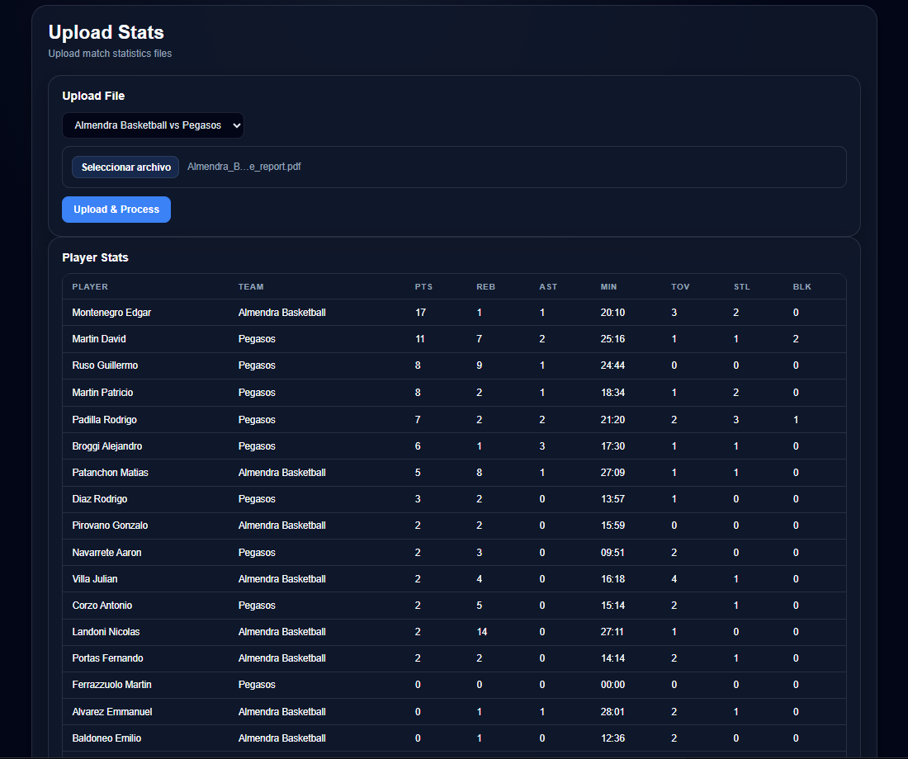

# Basket Stats

Basket Stats is a cloud-based web application for managing basketball teams, players, seasons, games and post-game statistics.

The project was developed as an MVP for **PP3 - Desarrollo e implementación de sistemas en la nube**, focusing on a functional microservices architecture, real database persistence, authentication, role-based permissions and PDF statistics processing.

---

## Preview

### Dashboard


### Teams


### Team Profile


### Players


### Upload Stats



### Rankings


### Compare


---

## Main Features

* User authentication with JWT.
* Public registration with default `player` role.
* Role-based permissions for `admin`, `coach`, `dt` and `player`.
* Team management.
* Player management.
* Season management.
* Game management.
* PDF upload and statistics processing.
* Automatic game result update after processing stats.
* Dashboard with real metrics and charts.
* Game analytics.
* Player rankings.
* Team comparison.
* Player profile.
* Team profile.
* Light and dark mode.

---

## Architecture

Basket Stats is divided into three main services:

```txt
Frontend
│
├── Management API
│   └── Management Database
│
└── Analytics API
    └── Analytics Database
```

### Frontend

The frontend is responsible for the user interface, private routes, role-based visual restrictions, API consumption, charts and user interaction.

### Management API

The Management API handles authentication, users, roles, teams, players, seasons and games.

### Analytics API

The Analytics API handles PDF uploads, statistics processing, rankings, player summaries, team stats and communication with the Management API to complete game results.

---

## Technologies

### Frontend

* React
* TypeScript
* Vite
* React Router
* Recharts
* CSS
* LocalStorage
* Vercel

### Backend

* Node.js
* Express
* TypeScript
* PostgreSQL
* Supabase
* JWT
* bcrypt
* multer
* PDF parsing
* Render

---

## User Roles

| Role           | Permissions                                                                    |
| -------------- | ------------------------------------------------------------------------------ |
| `admin`        | Full access to teams, players, seasons, games, uploads, analytics and rankings |
| `coach` / `dt` | Can manage teams and players, upload stats and view analytics                  |
| `player`       | Read-only access                                                               |

---

## Main Flow

```txt
1. User logs in or registers.
2. Teams are created.
3. Players are assigned to teams.
4. Seasons are created.
5. Games are scheduled.
6. A post-game PDF is uploaded.
7. The Analytics API processes the PDF.
8. Player and team stats are saved.
9. The game result is completed automatically.
10. Data becomes available in Dashboard, Rankings, Compare and Profiles.
```

---

## API Overview

### Management API

```txt
POST   /auth/register
POST   /auth/login

GET    /teams
POST   /teams
PUT    /teams/:id
DELETE /teams/:id

GET    /players
POST   /players
PUT    /players/:id
DELETE /players/:id

GET    /seasons
POST   /seasons
PUT    /seasons/:id
DELETE /seasons/:id

GET    /games
POST   /games
PUT    /games/:id
PATCH  /games/:id/result
DELETE /games/:id
```

### Analytics API

```txt
POST /uploads
GET  /uploads/:id

POST /analytics/process

GET  /analytics/games/:id/players
GET  /analytics/games/:id/teams

GET  /analytics/players/rankings
GET  /analytics/players/aggregated-rankings
GET  /analytics/players/:playerName/summary
```

---

## Environment Variables

### Frontend

```env
VITE_MANAGEMENT_API_URL=
VITE_ANALYTICS_API_URL=
```

### Management API

```env
DATABASE_URL=
JWT_SECRET=
JWT_EXPIRES_IN=
FRONTEND_URL=
```

### Analytics API

```env
DATABASE_URL=
JWT_SECRET=
JWT_EXPIRES_IN=
FRONTEND_URL=
MANAGEMENT_API_URL=
```

---

## How to Run Locally

### Frontend

```bash
npm install
npm run dev
```

### Backend services

```bash
npm install
npm run dev
```

Each backend service requires its own environment variables.

---

## Future Improvements

* Add user management for admins.
* Allow admins to change user roles from the app.
* Add AI-assisted PDF processing.
* Support CSV and Excel uploads.
* Improve game detail views.
* Add more dashboard filters.
* Add season and team filters to rankings.
* Improve data synchronisation between Management API and Analytics API.
* Allow coaches to create controlled friendly games.
* Add internationalisation support.

---

## Author

Developed by **Edgar Montenegro**.
