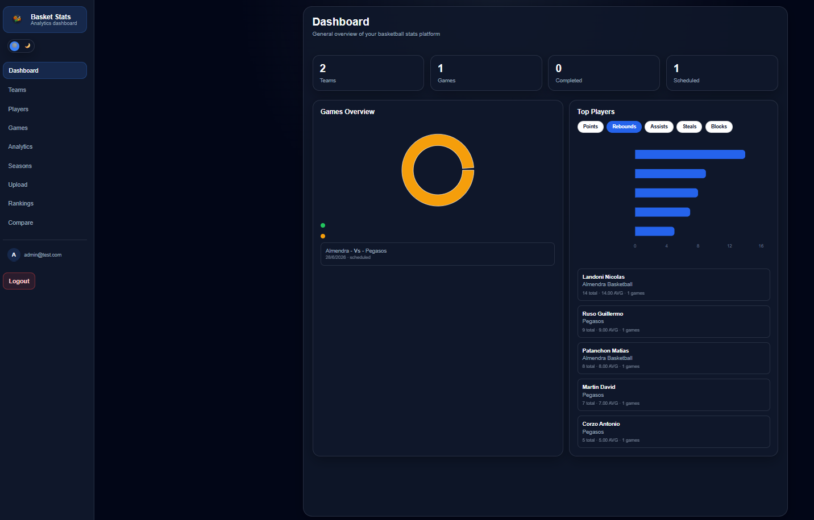
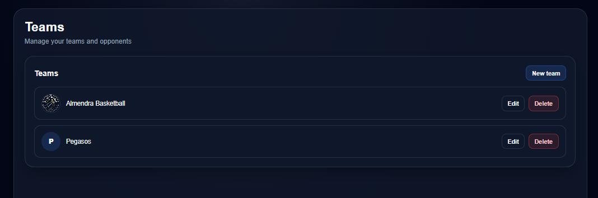
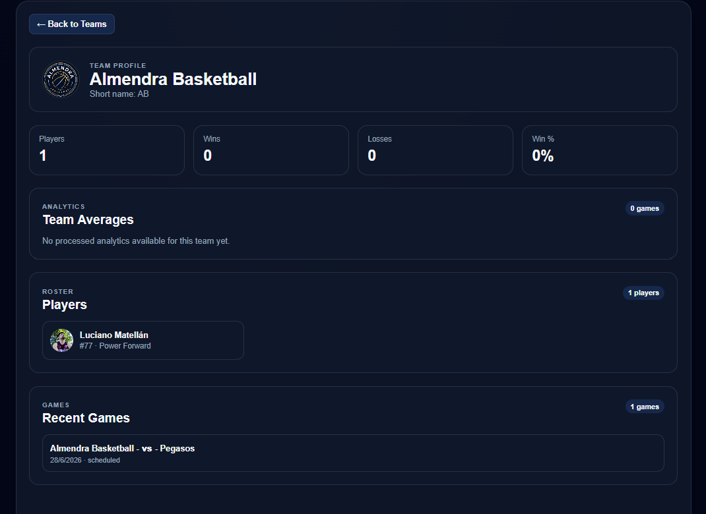
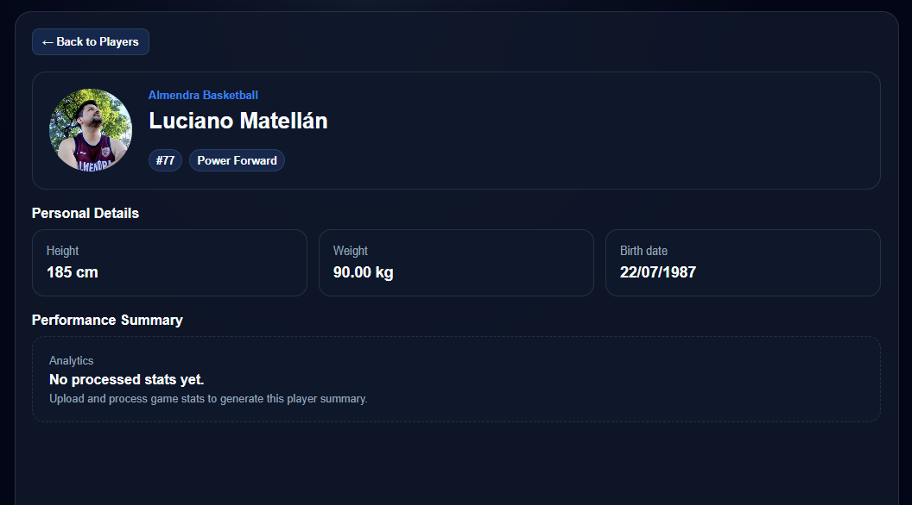
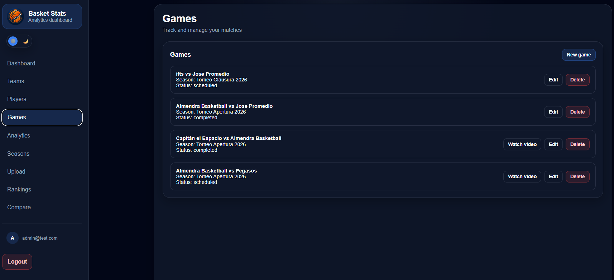
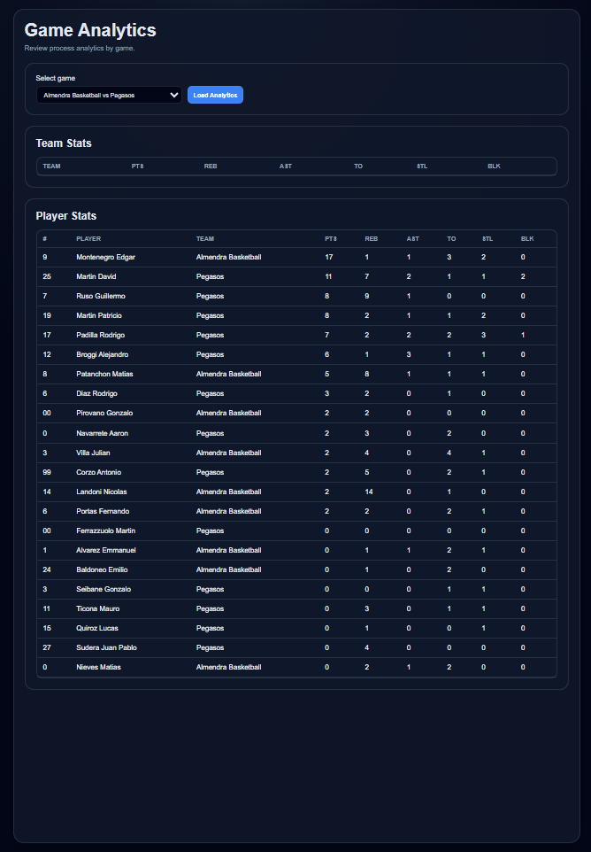
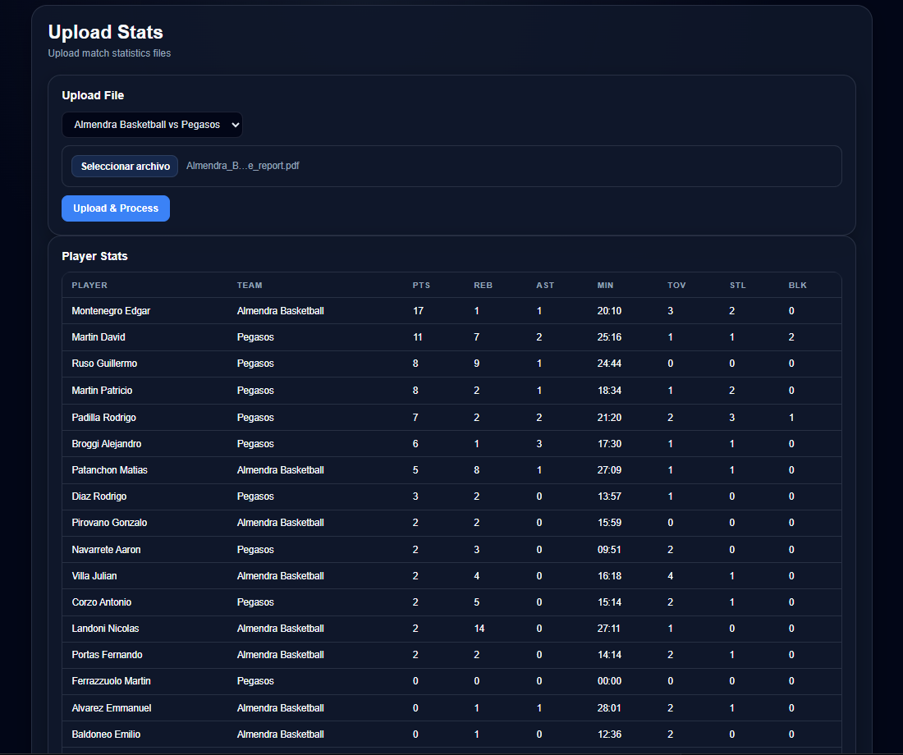
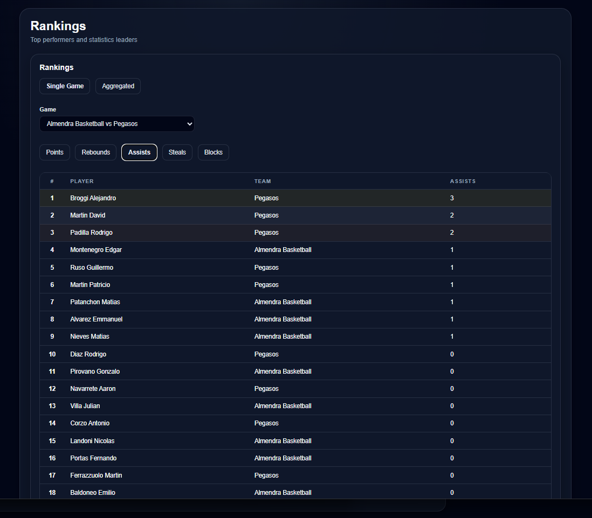
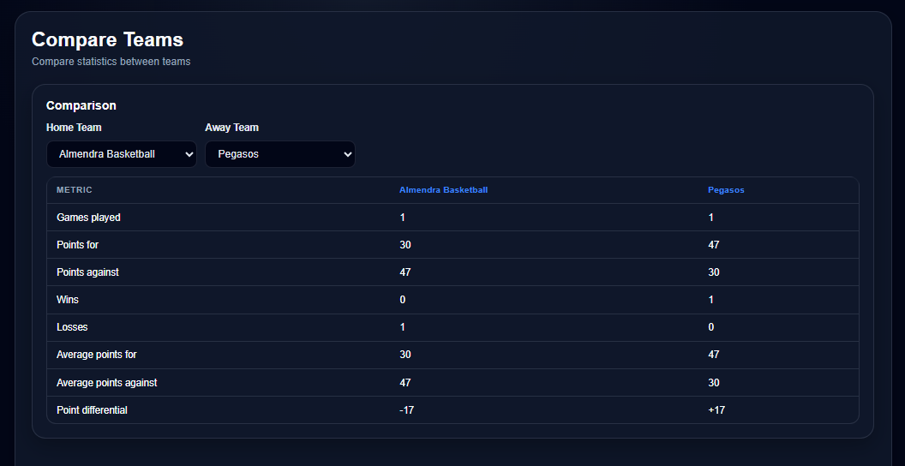

# Basket Stats - Frontend

Frontend application for **Basket Stats**, a basketball statistics platform developed as part of a cloud-based microservices project.

The application provides a web interface for managing teams, players, seasons and games, uploading post-game statistics, and visualising basketball performance data through rankings, comparisons and analytics.

The frontend is built with **React, TypeScript and Vite** and communicates with two independent backend services:

- **Management API** — responsible for application and data management.
- **Analytics API** — responsible for statistics processing and analytics.

The frontend is currently deployed on **Vercel**, while both backend services are deployed on an **Oracle Cloud VPS**. 

As the next infrastructure step, the frontend will also be migrated to the Oracle Cloud VPS so that the complete application runs within the same cloud infrastructure.

---

## Overview

Basket Stats follows a microservices-based architecture in which the frontend acts as the user-facing layer of the application.

```text
                         ┌──────────────────────┐
                         │       Frontend       │
                         │ React + TypeScript   │
                         │        Vite          │
                         │       Vercel         │
                         └──────────┬───────────┘
                                    │
                     ┌──────────────┴──────────────┐
                     │                             │
                     ▼                             ▼
          ┌─────────────────────┐       ┌─────────────────────┐
          │   Management API    │       │    Analytics API    │
          │                     │       │                     │
          │ Teams               │       │ PDF processing      │
          │ Players             │       │ Player statistics   │
          │ Seasons             │       │ Team statistics     │
          │ Games               │       │ Rankings            │
          │ Authentication      │       │ Analytics           │
          └─────────────────────┘       └─────────────────────┘
                  Oracle VPS                   Oracle VPS
                  
```
                  
The frontend is responsible for:

- User authentication and registration.
- Protected routes.
- Role-based interface permissions.
- Team and player management.
- Season and game management.
- Statistics upload.
- Statistical visualisation.
- Player rankings.
- Team comparisons.
- Game analytics.
- Responsive user interface.
- Light and dark themes.          


## Features

### Authentication

- User registration.
- User login.
- JWT-based authentication.
- Authentication data stored in browser `localStorage`.
- Protected application routes.
- Automatic redirection to the login page when authentication data is unavailable or invalid.

### Team Management

- View teams.
- Create teams.
- Edit teams.
- Delete teams.
- View individual team profiles.
- Display team logos and information.

### Player Management

- View players.
- Create players.
- Edit players.
- Delete players.
- Filter players by team.
- View individual player profiles.
- Display player statistics.

### Season Management

- View seasons.
- Create seasons.
- Edit seasons.
- Delete seasons.

### Game Management

- View games.
- Create games.
- Edit games.
- Delete games.
- Register game results.
- Display game status.
- Access game analytics.

### Statistics Upload

The frontend provides an interface for uploading post-game statistics in PDF format.

The upload workflow consists of two main steps:

1. Upload the PDF file.
2. Request processing of the uploaded statistics.

The Analytics API processes the uploaded document and makes the resulting statistical data available to the frontend.

### Analytics

The application provides several statistical views, including:

- Player statistics by game.
- Team statistics by game.
- Player rankings.
- Aggregated player rankings.
- Player summaries.
- Team statistical summaries.
- Game analytics.

### Team Comparison

The comparison view allows users to compare team performance using aggregated statistical data.

### Dashboard

The dashboard provides an overview of relevant application data through:

- Summary cards.
- Game status information.
- Top scorers.
- Statistical charts.

### Themes

The application supports both:

- Light mode.
- Dark mode.

The selected theme is persisted locally in the browser.

---

## User Roles

The frontend implements role-based interface permissions.

| Role | Teams | Players | Games | Seasons | Upload Stats |
| --- | --- | --- | --- | --- | --- |
| Admin | Manage | Manage | Manage | Manage | Yes |
| Coach | Manage | Manage | View | View | Yes |
| DT | Manage | Manage | View | View | Yes |
| Player | View | View | View | View | No |

The frontend normalises the `dt` role to the `coach` permission level.

Role-based permissions are implemented in:

`src/auth/permissions.ts`

The main permission helpers are:

```ts
canManageTeams()
canManagePlayers()
canManageGames()
canManageSeasons()
canUploadStats()
```

## Application Structure

```text
src/
├── assets/
│   ├── readme/
│   │   └── images/
│   └── logo.png
│
├── auth/
│   └── permissions.ts
│
├── components/
│   ├── common/
│   ├── games/
│   ├── helpers/
│   ├── layout/
│   ├── pages/
│   │   ├── compare/
│   │   ├── dashboard/
│   │   ├── games/
│   │   ├── login/
│   │   ├── players/
│   │   ├── rankings/
│   │   ├── register/
│   │   ├── seasons/
│   │   ├── teams/
│   │   └── uploads/
│   ├── services/
│   │   ├── api.ts
│   │   ├── authApi.ts
│   │   └── teamAnalytics.ts
│   ├── teams/
│   └── types/
│
├── routes/
│   ├── AppRouter.tsx
│   └── ProtectedRoute.tsx
│
├── App.tsx
├── index.css
└── main.tsx
```
## Routing

Application routes are defined in:

`src/routes/AppRouter.tsx`

### Public Routes

```text
/login
/register
```
### Protected Routes

```text
/
/dashboard
/teams
/teams/:id
/players
/players/:id
/games
/upload-stats
/rankings
/compare
/seasons
/analytics
```
The root route redirects to:

```text
/dashboard
```
Protected routes are handled through the ProtectedRoute component.

### Authentication and Route Protection

Authentication is handled through the Management API.

The frontend stores authentication data in localStorage using:

```text
basket_stats_token
basket_stats_user
```

The ProtectedRoute component checks whether the required authentication data is available before allowing access to protected routes.

If the authentication data is missing or invalid, the user is redirected to:

```text
/login
```

Authentication requests are implemented in:

```text
src/components/services/authApi.ts
```

## API Integration

The frontend communicates with two independent backend services.

### Management API

The Management API is used for:

- Authentication.
- Teams.
- Players.
- Seasons.
- Games.

### Analytics API

The Analytics API is used for:

- PDF uploads.
- Statistics processing.
- Player statistics.
- Team statistics.
- Rankings.
- Aggregated rankings.
- Player summaries.
- Game analytics.
- Team statistical data.

The main API integration is implemented in:

```text
src/components/services/api.ts
```

Authentication-specific requests are implemented in:

```text
src/components/services/authApi.ts
```

Team analytics aggregation is implemented in:

```text
src/components/services/teamAnalytics.ts
```

## Environment Variables

The frontend requires the following environment variables:

```dotenv
VITE_MANAGEMENT_API_URL=
VITE_ANALYTICS_API_URL=
```
Example:

```dotenv
VITE_MANAGEMENT_API_URL=https://<management-api-url>
VITE_ANALYTICS_API_URL=https://<analytics-api-url>
```

These variables define the URLs used by the frontend to communicate with the backend services.

Environment-specific configuration should not be hardcoded into the application.

## Technologies

### Core

- React
- TypeScript
- Vite

### Routing

- React Router

### Data Visualisation

- Recharts

### Styling

- CSS

### Authentication

- JWT
- Browser localStorage

### Development Tools

- TypeScript
- ESLint
- Vite

## Installation

Clone the repository and install the project dependencies:

```bash
npm install
```
Create a .env file in the project root:

```dotenv
VITE_MANAGEMENT_API_URL=<management-api-url>
VITE_ANALYTICS_API_URL=<analytics-api-url>
```
Start the development server:

```bash
npm run dev
```

## Available Scripts

### Development

```bash
npm run dev
```
Starts the Vite development server.

### Build

```bash
npm run build
```
Runs the TypeScript build and generates the production bundle.

### Lint

```bash
npm run lint
```

Runs ESLint across the project.

### Preview

```bash
npm run preview
```
Serves the production build locally for preview.

## Deployment

### Current Infrastructure

The current deployment is distributed across two environments:

| Component | Infrastructure |
| --- | --- |
| Frontend | Vercel |
| Management API | Oracle Cloud VPS |
| Analytics API | Oracle Cloud VPS |

### Planned Migration

The next infrastructure step is to migrate the frontend from Vercel to the Oracle Cloud VPS.

The target architecture is:

```text
Oracle Cloud VPS
│
├── Frontend
├── Management API
└── Analytics API
```
This will consolidate the three application components within the same cloud infrastructure.

## Screenshots

### Dashboard



### Teams



### Team Profile



### Players



### Games


### Game Analytics 


### Upload Statistics



### Rankings



### Team Comparison



---

## Project Documentation

Additional documentation and diagrams are available in:

```text
docs/
├── diagrams/
└── final-delivery.md
```
The available sequence diagrams cover application flows such as:

- Login.
- Registration.
- Teams.
- Players.
- Games.
- Rankings.
- Team comparison.
- Statistics upload and processing.

## Related Services

Basket Stats is composed of three independent repositories:

| Repository | Responsibility |
| --- | --- |
| Frontend | User interface and interaction |
| Management API | Application data and management operations |
| Analytics API | Statistics processing and analytics |

The frontend communicates with both backend services through HTTP APIs.