# Basket Stats – Entregable Final PP3

## 1. Objetivo del sistema

Basket Stats es una aplicación web desarrollada como MVP para la materia PP3 – Desarrollo e implementación de sistemas en la nube.

El objetivo del sistema es permitir la gestión de equipos, jugadores, temporadas, partidos y estadísticas de básquet, integrando carga de archivos PDF, procesamiento de datos, visualización de métricas y análisis deportivo.

El proyecto fue desarrollado aplicando una arquitectura basada en frontend web, microservicios backend, bases de datos separadas y despliegue en la nube.

---

## 2. MVP funcional

El MVP permite actualmente:

- Registrar e iniciar sesión de usuarios.
- Gestionar equipos.
- Gestionar jugadores.
- Gestionar temporadas.
- Gestionar partidos.
- Subir archivos PDF con estadísticas.
- Procesar estadísticas individuales y de equipo.
- Completar automáticamente resultados de partidos.
- Consultar dashboard con métricas y gráficos.
- Consultar rankings.
- Comparar equipos.
- Visualizar perfiles de jugadores.
- Visualizar perfiles de equipos.
- Aplicar permisos según rol.

---

## 3. Arquitectura general

El sistema utiliza una arquitectura web basada en cliente-servidor y microservicios.  
El frontend se encuentra desplegado en Vercel y consume dos APIs independientes desplegadas en Render: una API de gestión y una API de análisis estadístico.

La información administrativa del sistema se almacena en una base de datos Supabase asociada a la Management API, mientras que las estadísticas procesadas desde archivos PDF se almacenan en una base de datos Supabase separada asociada a la Analytics API.

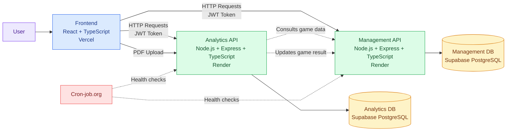
---

## 4. Patrones arquitecturales aplicados

El sistema aplica una combinación de patrones arquitecturales orientados a separar responsabilidades, facilitar el mantenimiento y permitir el despliegue independiente de sus componentes.

### Cliente-servidor

Basket Stats utiliza una arquitectura cliente-servidor.  
El frontend funciona como cliente web y se comunica con los servidores mediante requests HTTP.

Las APIs reciben las solicitudes, aplican reglas de negocio, validan permisos y consultan las bases de datos correspondientes.

### Arquitectura en capas

Cada backend está organizado separando responsabilidades principales:

- Rutas: definen los endpoints disponibles.
- Middlewares: validan autenticación, permisos, CORS y configuración general.
- Controladores o handlers: reciben la request y preparan la response.
- Servicios: contienen la lógica de negocio.
- Acceso a datos: interactúa con Supabase/PostgreSQL.

Esta separación permite que la lógica del sistema no quede mezclada directamente con las rutas HTTP.

### Microservicios

El sistema separa responsabilidades en dos APIs independientes:

- Management API: gestiona usuarios, equipos, jugadores, temporadas y partidos.
- Analytics API: gestiona uploads, procesamiento de PDFs, estadísticas, rankings y comparaciones.

Esta división permite que cada servicio tenga una responsabilidad clara, su propia base de datos y su propio despliegue.

### Tres capas

A nivel general, la aplicación puede entenderse en tres capas principales:

- Capa de presentación: frontend React desplegado en Vercel.
- Capa de lógica de negocio: APIs Node.js/Express desplegadas en Render.
- Capa de datos: bases de datos PostgreSQL administradas con Supabase.

### REST API

La comunicación entre frontend y backend se realiza mediante endpoints REST usando métodos HTTP como GET, POST, PUT, PATCH y DELETE.

Esto permite una comunicación simple, clara y alineada con las operaciones principales del sistema.

---

## 5. Capas de la aplicación

La aplicación está organizada en tres capas principales: presentación, lógica de negocio y acceso a datos.

### Capa de presentación

La capa de presentación corresponde al frontend desarrollado con React, TypeScript y Vite.

Sus responsabilidades principales son:

- Mostrar la interfaz de usuario.
- Gestionar la navegación entre vistas.
- Manejar formularios y validaciones iniciales.
- Guardar la sesión del usuario en localStorage.
- Enviar el token JWT en las requests protegidas.
- Aplicar restricciones visuales según el rol del usuario.
- Consumir los endpoints de Management API y Analytics API.
- Mostrar métricas, gráficos, rankings, perfiles y comparaciones.

Esta capa no accede directamente a la base de datos.

### Capa de lógica de negocio

La capa de lógica de negocio se encuentra en los backends desplegados en Render.

Está dividida en dos servicios:

- Management API.
- Analytics API.

La Management API contiene la lógica relacionada con:

- Autenticación.
- Registro de usuarios.
- Roles y permisos.
- Equipos.
- Jugadores.
- Temporadas.
- Partidos.
- Resultados.

La Analytics API contiene la lógica relacionada con:

- Carga de archivos PDF.
- Procesamiento de estadísticas.
- Validación de equipos detectados.
- Normalización de nombres.
- Estadísticas individuales.
- Estadísticas de equipo.
- Rankings.
- Comparaciones.
- Resúmenes por jugador.

### Capa de acceso a datos

La capa de acceso a datos utiliza Supabase PostgreSQL.

El sistema mantiene dos bases de datos separadas:

- Management DB: almacena usuarios, equipos, jugadores, temporadas y partidos.
- Analytics DB: almacena uploads, estadísticas individuales y estadísticas de equipo.

Esta separación acompaña la división del sistema en microservicios y evita mezclar datos administrativos con datos analíticos.

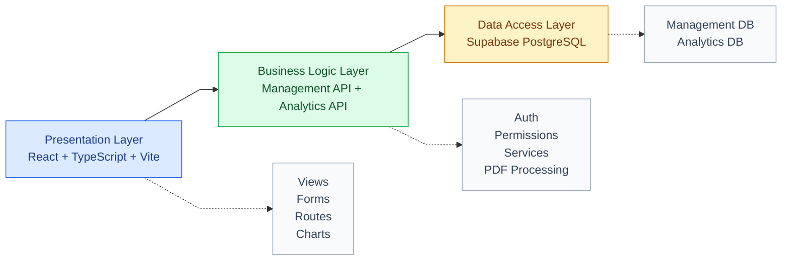
---

## 6. Microarquitectura de los servidores

La microarquitectura de los servidores está organizada en capas internas para separar las responsabilidades del backend.

Tanto la Management API como la Analytics API siguen una estructura similar:

- Routes: definen los endpoints disponibles.
- Middlewares: gestionan autenticación, permisos, CORS y validaciones generales.
- Controllers / Handlers: reciben la request, validan datos básicos y devuelven la response.
- Services: contienen la lógica principal del negocio.
- Data Access: ejecuta consultas contra Supabase/PostgreSQL.
- Database: almacena la información persistente.

Esta organización permite mantener el código más ordenado, reutilizable y fácil de probar.

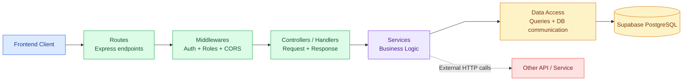

### Management API

La Management API se encarga de la información administrativa del sistema.

Sus responsabilidades principales son:

- Autenticación.
- Registro de usuarios.
- Validación de roles.
- Gestión de equipos.
- Gestión de jugadores.
- Gestión de temporadas.
- Gestión de partidos.
- Actualización de resultados.

### Analytics API

La Analytics API se encarga de la información estadística del sistema.

Sus responsabilidades principales son:

- Carga de archivos PDF.
- Procesamiento de estadísticas.
- Normalización de nombres.
- Validación de equipos detectados.
- Persistencia de estadísticas individuales.
- Persistencia de estadísticas de equipo.
- Rankings.
- Comparaciones.
- Comunicación con Management API para consultar partidos y actualizar resultados.

---

## 7. Historias de usuario

Las siguientes historias de usuario representan los casos de uso principales del MVP y se corresponden con los flujos definidos en los diagramas de secuencia.

### Historia 1 – Inicio de sesión

**Como** usuario registrado,  
**quiero** iniciar sesión con mi email y contraseña,  
**para** acceder a las funcionalidades del sistema según mi rol.

**Criterios de aceptación:**

- El usuario debe poder ingresar email y contraseña.
- Si las credenciales son válidas, el sistema debe guardar el token JWT y los datos del usuario.
- Si las credenciales son inválidas, el sistema debe mostrar un mensaje de error.
- El usuario autenticado debe ser redirigido al dashboard.

---

### Historia 2 – Registro de usuario

**Como** visitante,  
**quiero** registrarme en la aplicación,  
**para** poder acceder al sistema con una cuenta propia.

**Criterios de aceptación:**

- El usuario debe poder ingresar nombre, email y contraseña.
- El sistema debe validar que el email no esté registrado previamente.
- El usuario registrado debe crearse con rol inicial `player`.
- Luego del registro, el usuario debe poder iniciar sesión.

---

### Historia 3 – Gestión de equipos

**Como** administrador,  
**quiero** crear, editar y eliminar equipos,  
**para** organizar la información deportiva del sistema.

**Criterios de aceptación:**

- El administrador debe poder crear equipos con nombre, nombre corto y logo opcional.
- El sistema debe validar los datos antes de guardar.
- El administrador debe poder editar la información de un equipo existente.
- El sistema debe impedir eliminar equipos que tengan jugadores, temporadas o partidos asociados.

---

### Historia 4 – Gestión de jugadores

**Como** administrador o coach,  
**quiero** crear y administrar jugadores,  
**para** asociarlos a sus equipos y consultar su información deportiva.

**Criterios de aceptación:**

- El usuario autorizado debe poder crear jugadores asociados a un equipo.
- El sistema debe validar nombre, apellido, número, posición y fecha de nacimiento.
- El usuario autorizado debe poder editar jugadores existentes.
- Los usuarios con rol `player` solo deben tener acceso de lectura.

---

### Historia 5 – Gestión de partidos

**Como** administrador,  
**quiero** crear partidos entre dos equipos,  
**para** planificar la carga y análisis de estadísticas.

**Criterios de aceptación:**

- El administrador debe poder seleccionar temporada, equipo local y equipo visitante.
- El sistema debe impedir seleccionar el mismo equipo como local y visitante.
- El partido debe crearse inicialmente como programado.
- El partido debe quedar disponible para la carga posterior de estadísticas.

---

### Historia 6 – Carga y procesamiento de estadísticas

**Como** administrador o coach,  
**quiero** subir un archivo PDF de estadísticas de un partido,  
**para** procesar automáticamente los datos individuales y de equipo.

**Criterios de aceptación:**

- El usuario autorizado debe poder seleccionar un partido y subir un archivo PDF.
- El sistema debe validar que el archivo corresponda al partido seleccionado.
- La Analytics API debe procesar el PDF y guardar estadísticas individuales y de equipo.
- El sistema debe completar automáticamente el resultado del partido.
- El sistema debe evitar reprocesar estadísticas duplicadas del mismo partido.

---

### Historia 7 – Consulta de rankings

**Como** usuario del sistema,  
**quiero** consultar rankings de jugadores,  
**para** identificar líderes estadísticos en puntos, rebotes, asistencias, robos y tapas.

**Criterios de aceptación:**

- El usuario debe poder seleccionar la estadística a consultar.
- El sistema debe mostrar rankings individuales por partido.
- El sistema debe mostrar rankings agregados.
- El dashboard debe mostrar rankings sin duplicar jugadores por partido.

---

### Historia 8 – Comparación de equipos

**Como** usuario del sistema,  
**quiero** comparar dos equipos,  
**para** analizar su rendimiento estadístico de forma lado a lado.

**Criterios de aceptación:**

- El usuario debe poder seleccionar dos equipos diferentes.
- El sistema debe impedir comparar un equipo contra sí mismo.
- El sistema debe mostrar estadísticas de ambos equipos.
- Los nombres de los equipos deben permitir navegar hacia sus perfiles.

---

## 8. Diagramas de secuencia

### Diagrama 1 – Inicio de sesión

```mermaid
%%{init: {'theme': 'base', 'themeCSS': 'svg { background: #ffffff; }', 'themeVariables': { 'actorBkg': '#ede9fe', 'actorBorder': '#7c3aed', 'actorTextColor': '#4c1d95', 'participantBkg': '#dbeafe', 'participantBorder': '#2563eb', 'participantTextColor': '#1e3a8a', 'signalColor': '#111827', 'signalTextColor': '#111827', 'labelTextColor': '#111827', 'noteBkgColor': '#fef3c7', 'noteTextColor': '#78350f' }}}%%
    actor User as Usuario
    participant FE as Frontend
    participant API as Management API
    participant DB as Management DB

    User->>FE: Ingresa email y contraseña
    FE->>API: POST /auth/login
    API->>DB: Busca usuario por email
    DB-->>API: Devuelve usuario
    API->>API: Valida password y genera JWT
    API-->>FE: Devuelve token y datos del usuario
    FE->>FE: Guarda token y user en localStorage
    FE-->>User: Redirige al dashboard
```

### Diagrama 2 – Registro de usuario

```mermaid
%%{init: {'theme': 'base', 'themeCSS': 'svg { background: #ffffff; }', 'themeVariables': { 'actorBkg': '#ede9fe', 'actorBorder': '#7c3aed', 'actorTextColor': '#4c1d95', 'participantBkg': '#dbeafe', 'participantBorder': '#2563eb', 'participantTextColor': '#1e3a8a', 'signalColor': '#111827', 'signalTextColor': '#111827', 'labelTextColor': '#111827', 'noteBkgColor': '#fef3c7', 'noteTextColor': '#78350f' }}}%%
    actor User as Visitante
    participant FE as Frontend
    participant API as Management API
    participant DB as Management DB

    User->>FE: Completa formulario de registro
    FE->>API: POST /auth/register
    API->>DB: Verifica si el email ya existe
    DB-->>API: Resultado de búsqueda
    API->>API: Hashea password y asigna rol player
    API->>DB: Inserta nuevo usuario
    DB-->>API: Usuario creado
    API-->>FE: Confirma registro
    FE-->>User: Muestra mensaje y permite iniciar sesión
```

### Diagrama 3 – Gestión de equipos

```mermaid
%%{init: {'theme': 'base', 'themeCSS': 'svg { background: #ffffff; }', 'themeVariables': { 'actorBkg': '#ede9fe', 'actorBorder': '#7c3aed', 'actorTextColor': '#4c1d95', 'participantBkg': '#dbeafe', 'participantBorder': '#2563eb', 'participantTextColor': '#1e3a8a', 'signalColor': '#111827', 'signalTextColor': '#111827', 'labelTextColor': '#111827', 'noteBkgColor': '#fef3c7', 'noteTextColor': '#78350f' }}}%%
    actor Admin as Administrador
    participant FE as Frontend
    participant API as Management API
    participant DB as Management DB

    Admin->>FE: Completa formulario de equipo
    FE->>FE: Valida datos básicos
    FE->>API: POST /teams con JWT
    API->>API: Valida token y permisos
    API->>DB: Inserta equipo
    DB-->>API: Equipo creado
    API-->>FE: Devuelve equipo creado
    FE-->>Admin: Actualiza listado de equipos
```

### Diagrama 4 – Gestión de jugadores

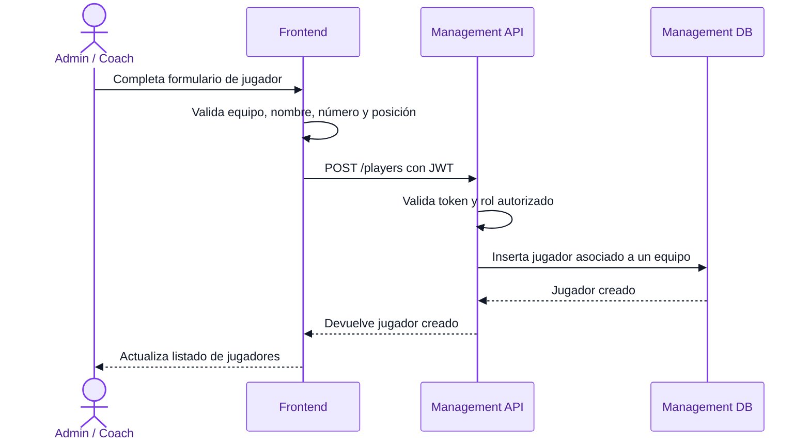

### Diagrama 5 – Creación de partido

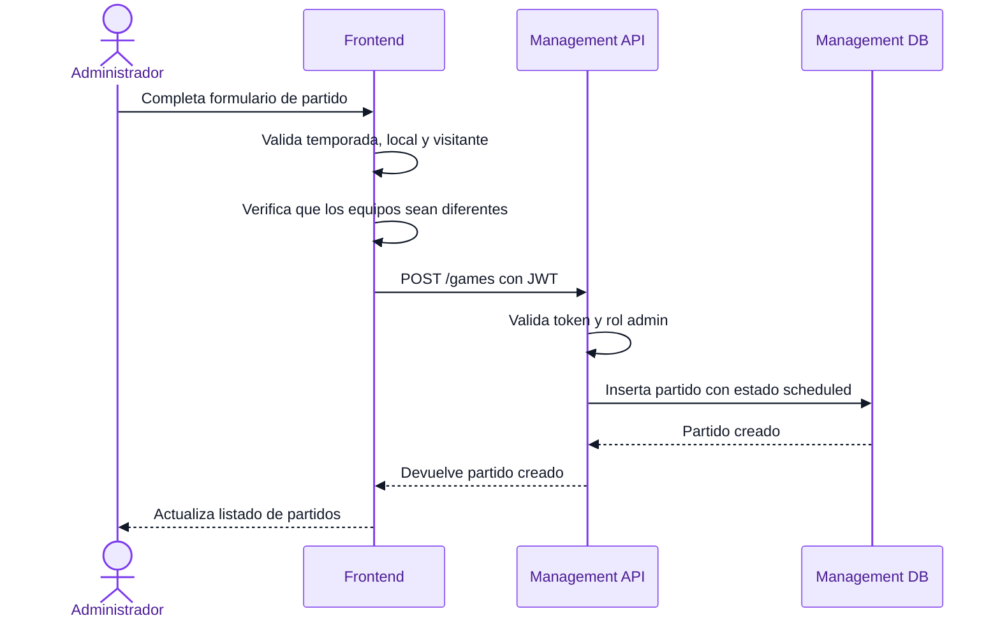

### Diagrama 6 – Carga y procesamiento de PDF

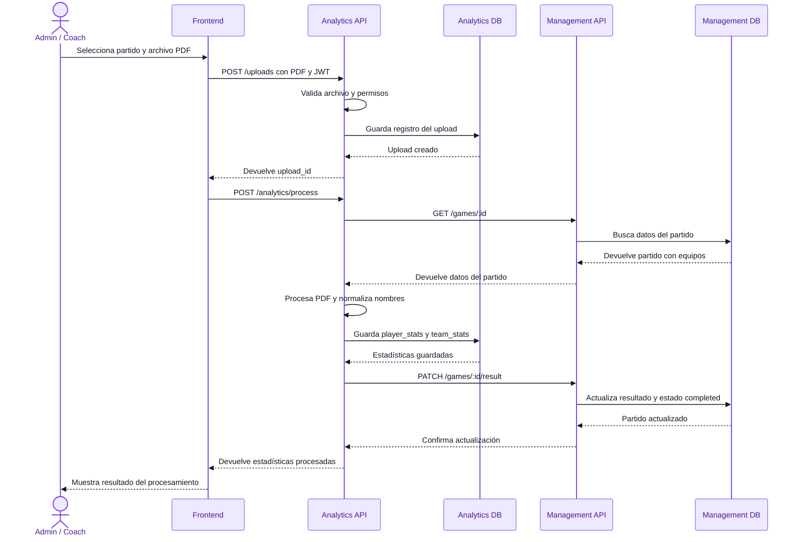

### Diagrama 7 – Consulta de rankings

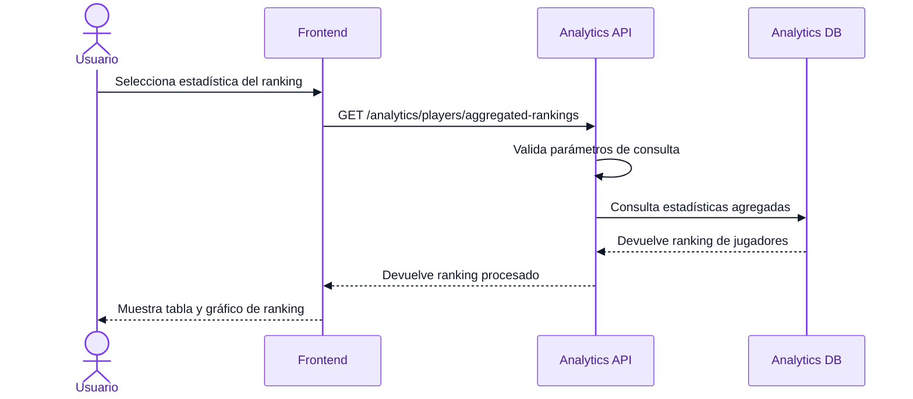

### Diagrama 8 – Comparación de equipos

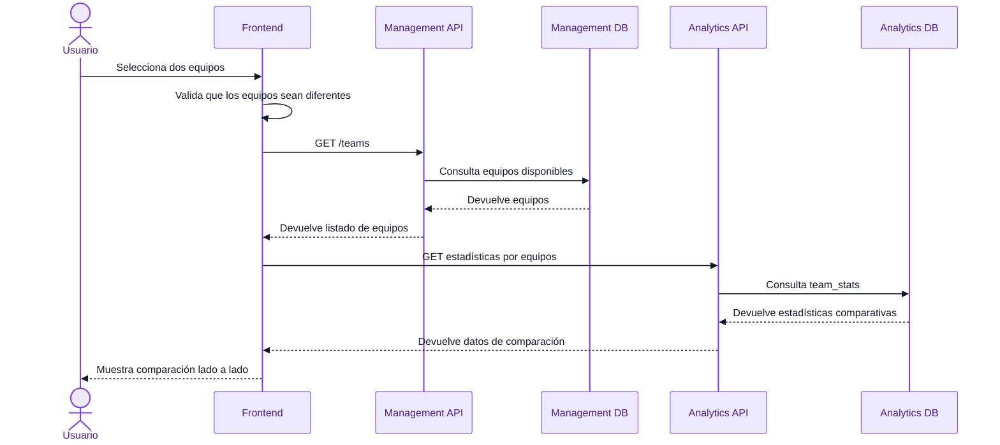
---

## 9. Mockups funcionales

Los mockups funcionales del sistema se representan mediante capturas reales del MVP implementado.

Estas pantallas permiten comprender la navegación principal de la aplicación, las interacciones disponibles y el flujo completo del usuario dentro del sistema.

El conjunto de mockups cubre más del 80% del sistema, incluyendo autenticación, dashboard, gestión deportiva, carga de estadísticas, análisis, rankings, comparación y perfiles.

### Login

Pantalla de inicio de sesión para usuarios registrados.

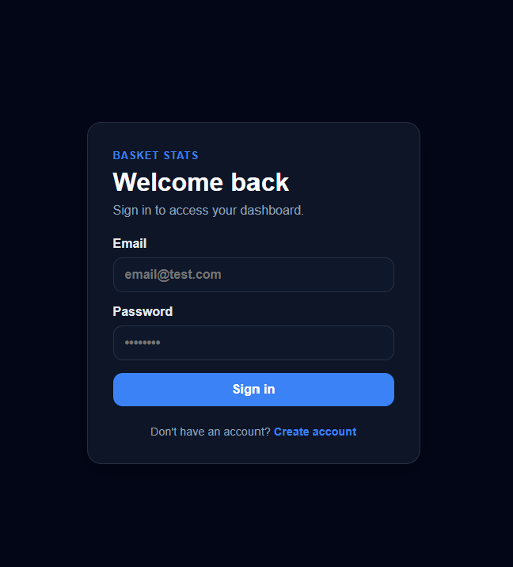

### Register

Pantalla de registro de nuevos usuarios.

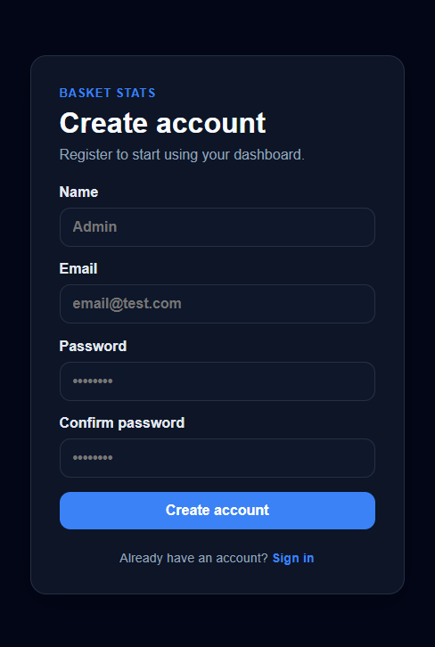

### Dashboard

Vista principal del sistema con métricas, gráficos, resumen de partidos y ranking dinámico.

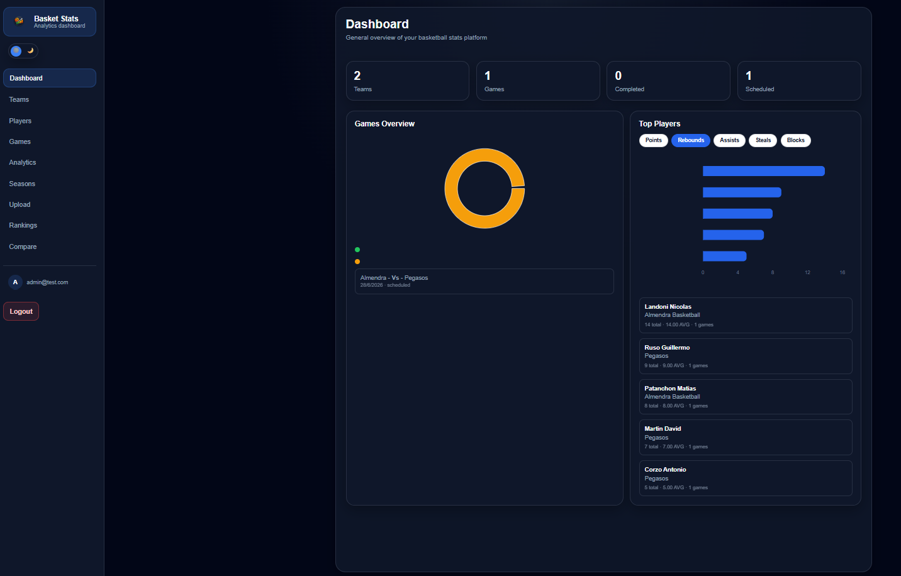

### Teams

Vista de gestión y consulta de equipos.

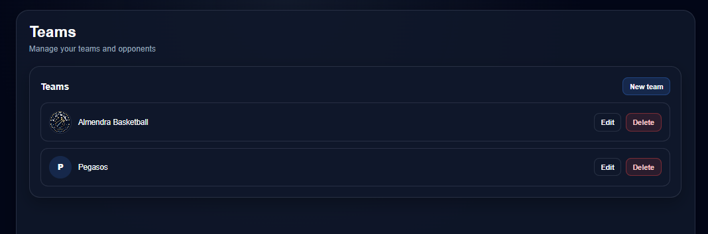

### Team Profile

Perfil de equipo con información general, roster, rendimiento y partidos recientes.

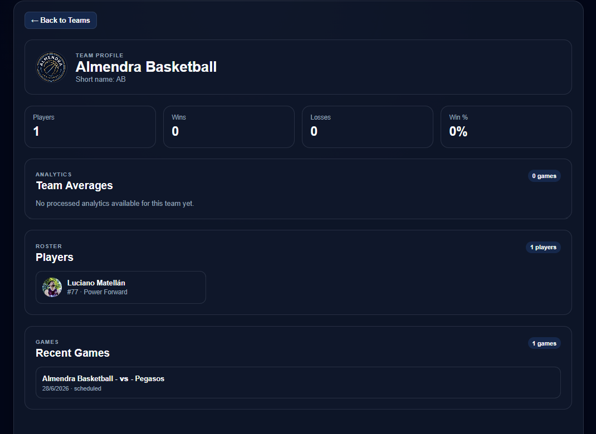

### Players

Vista de gestión y consulta de jugadores.

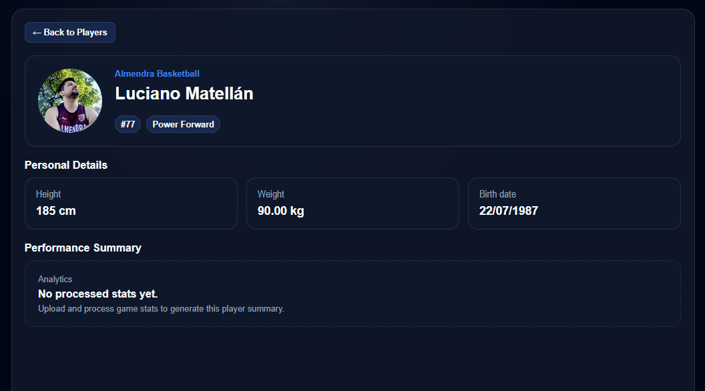

### Player Profile

Perfil individual del jugador con datos personales y resumen de rendimiento.

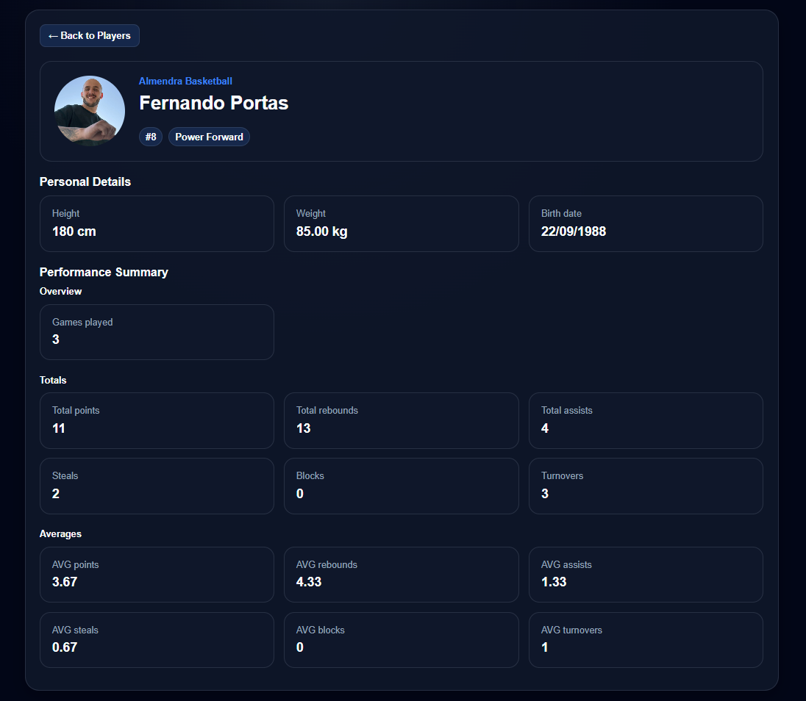

### Games

Vista de gestión y consulta de partidos.

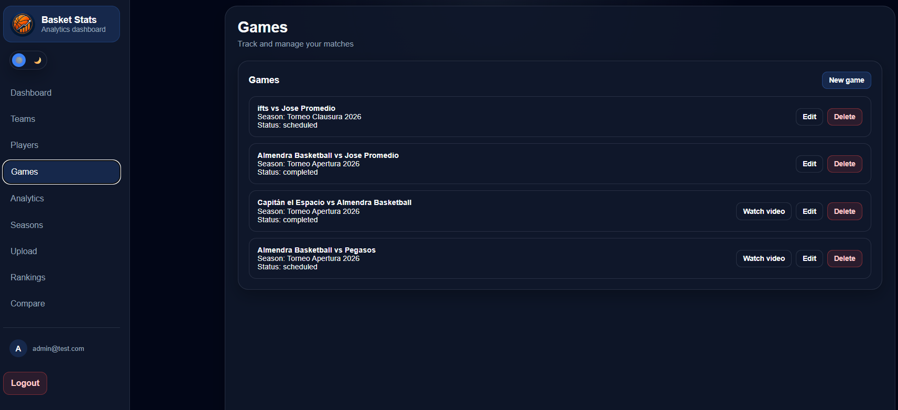

### Upload Stats

Vista para seleccionar un partido, subir un archivo PDF y procesar estadísticas.

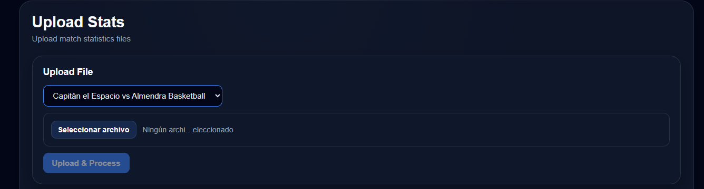

### Game Analytics

Vista de estadísticas procesadas por partido.

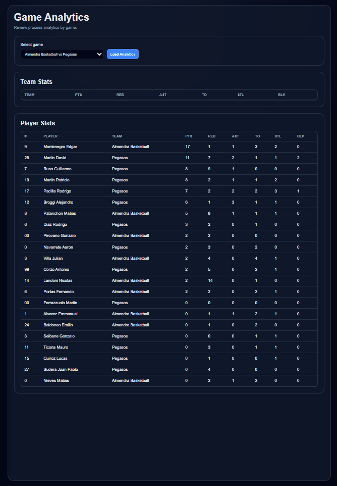

### Rankings

Vista de rankings individuales y agregados por estadística.

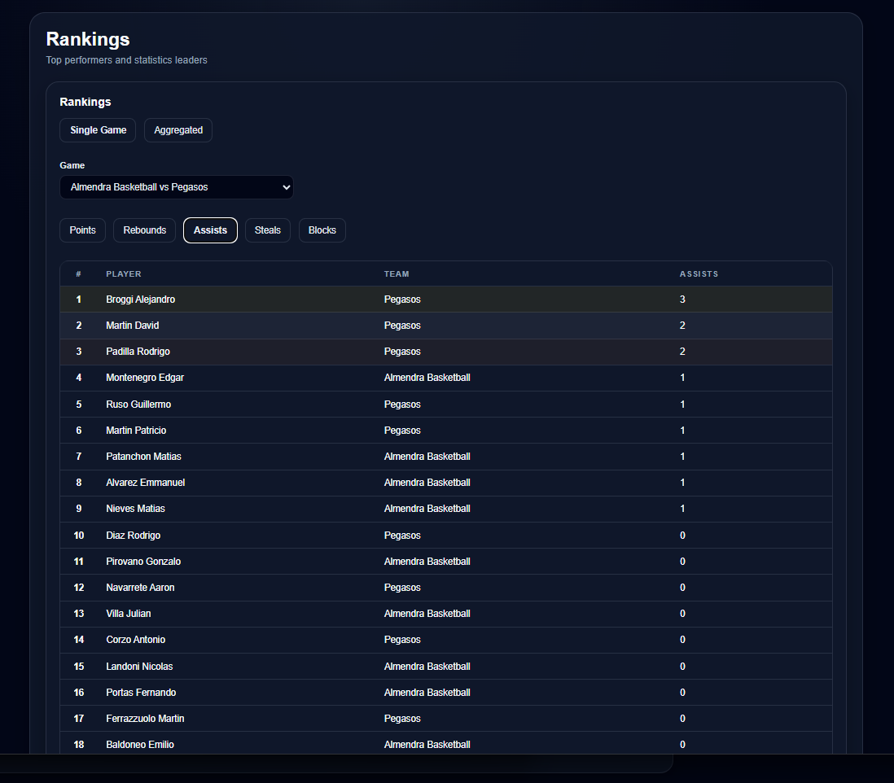

### Compare

Vista de comparación estadística entre dos equipos.

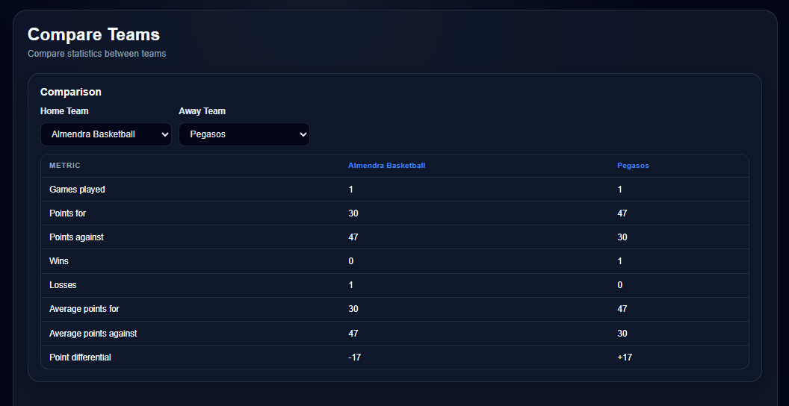

---

## 10. Repositorios y despliegues

## 10. Repositorios y despliegues

El proyecto se encuentra alojado en GitHub y sus componentes principales están desplegados en servicios cloud accesibles desde Internet.

La aplicación está dividida en tres componentes principales:

- Frontend web.
- Management API.
- Analytics API.

Cada componente tiene responsabilidades separadas y se encuentra desplegado de forma independiente.

---

### Frontend

El frontend es la aplicación web utilizada por los usuarios finales.

Fue desarrollado con:

- React.
- TypeScript.
- Vite.
- React Router.
- CSS.
- Recharts.

Responsabilidades principales:

- Mostrar la interfaz de usuario.
- Gestionar la navegación.
- Consumir las APIs.
- Guardar la sesión del usuario.
- Enviar el token JWT en requests protegidas.
- Aplicar permisos visuales según rol.
- Mostrar dashboard, gráficos, rankings, perfiles y comparaciones.

**Deploy:**

```txt
https://basket-stats-frontend.vercel.app
```

**Servicio utilizado:**

```txt
Vercel
```

**Repositorio:**

```txt
https://github.com/Edgarmontenegro123/basket-stats-frontend
```

---

### Management API

La Management API es el backend encargado de la información administrativa del sistema.

Fue desarrollada con:

- Node.js.
- Express.
- TypeScript.
- PostgreSQL.
- Supabase.
- JWT.
- bcrypt.

Responsabilidades principales:

- Registro de usuarios.
- Login.
- Autenticación con JWT.
- Validación de roles y permisos.
- Gestión de equipos.
- Gestión de jugadores.
- Gestión de temporadas.
- Gestión de partidos.
- Actualización de resultados.

**Deploy:**

```txt
https://basket-stats-management-api-node.onrender.com
```

**Health check:**

```txt
https://basket-stats-management-api-node.onrender.com/health
```

**Servicio utilizado:**

```txt
Render
```

**Repositorio:**

```txt
https://github.com/Edgarmontenegro123/basket-stats-management-api-node
```

---

### Analytics API

La Analytics API es el backend encargado de la carga, procesamiento y consulta de estadísticas deportivas.

Fue desarrollada con:

- Node.js.
- Express.
- TypeScript.
- PostgreSQL.
- Supabase.
- Multer.
- PDF parsing.
- JWT.

Responsabilidades principales:

- Carga de archivos PDF.
- Procesamiento de estadísticas.
- Normalización de nombres.
- Validación de equipos detectados.
- Persistencia de estadísticas individuales.
- Persistencia de estadísticas de equipo.
- Consulta de rankings.
- Consulta de rankings agregados.
- Comparación de equipos.
- Resumen estadístico por jugador.
- Comunicación con Management API para consultar partidos y actualizar resultados.

**Deploy:**

```txt
https://basket-stats-analytics-api-node.onrender.com
```

**Health check:**

```txt
https://basket-stats-analytics-api-node.onrender.com/health
```

**Servicio utilizado:**

```txt
Render
```

**Repositorio:**

```txt
https://github.com/Edgarmontenegro123/basket-stats-analytics-api-node
```

---

### Base de datos

El sistema utiliza Supabase PostgreSQL como base de datos.

Se utilizan dos bases de datos separadas:

- Management DB.
- Analytics DB.

La Management DB almacena:

- Usuarios.
- Equipos.
- Jugadores.
- Temporadas.
- Partidos.

La Analytics DB almacena:

- Uploads.
- Estadísticas individuales.
- Estadísticas de equipo.

Esta separación acompaña la arquitectura de microservicios y evita mezclar información administrativa con información analítica.

---

### Servicios externos utilizados

El proyecto utiliza los siguientes servicios externos:

- GitHub para control de versiones.
- Vercel para el despliegue del frontend.
- Render para el despliegue de las APIs.
- Supabase para las bases de datos PostgreSQL.
- Cron-job.org para ejecutar health checks periódicos sobre las APIs desplegadas en Render.

---

### URLs principales del sistema

```txt
Frontend:
https://basket-stats-frontend.vercel.app

Management API:
https://basket-stats-management-api-node-a6kt.onrender.com

Management API health:
https://basket-stats-management-api-node-a6kt.onrender.com/health

Analytics API:
https://basket-stats-analytics-api-node-8d9z.onrender.com

Analytics API health:
https://basket-stats-analytics-api-node-8d9z.onrender.com/health
```

---

### Repositorios GitHub

```txt
Frontend repository:
https://github.com/Edgarmontenegro123/basket-stats-frontend

Management API repository:
https://github.com/Edgarmontenegro123/basket-stats-management-api-node

Analytics API repository:
https://github.com/Edgarmontenegro123/basket-stats-analytics-api-node
```

---

## 11. Conclusión

Basket Stats cumple con el objetivo de presentar un MVP funcional desplegado en la nube, integrando frontend web, microservicios backend, bases de datos separadas, autenticación, roles, procesamiento de archivos PDF y visualización de estadísticas deportivas.

El sistema permite demostrar conceptos de arquitectura cliente-servidor, arquitectura en capas, microservicios, APIs REST, control de versiones, despliegue cloud y persistencia en bases de datos reales.

Además, el proyecto deja planteadas mejoras futuras como administración de usuarios desde la aplicación, soporte para nuevos formatos de carga, mayor integración entre servicios y uso de inteligencia artificial para mejorar el procesamiento de estadísticas.